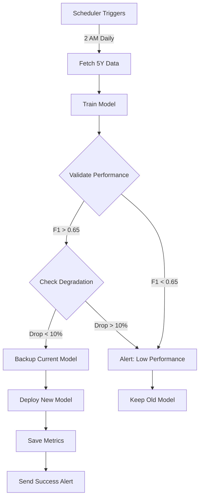

# Week 1: Daily Auto-Retraining Implementation

**Status:** ✅ COMPLETED  
**Duration:** ~4 hours  
**Phase:** 1.1 - ML Modernization

---

## Overview

Implemented automated daily model retraining to prevent concept drift and keep the ML model fresh. The system automatically retrains the model every night at 2 AM using the latest 5 years of market data, validates performance before deployment, and provides rollback capabilities.

## Problem Solved

**Before:** Model was trained once and never updated, leading to:

- Concept drift as market conditions change
- Degrading performance over time
- Manual retraining required
- No model versioning or rollback

**After:** Model automatically learns from new data every day:

- Continuous adaptation to market patterns
- Performance validation before deployment
- Automated backup and rollback
- Comprehensive metrics tracking

---

## Implementation

### 1. Core Module: `model_retraining.py`

**Location:** `src/trading_engine/model_retraining.py`

**Key Components:**

#### ModelRetrainingService Class

```python
class ModelRetrainingService:
    def __init__(self):
        self.scheduler = BackgroundScheduler()
        self.current_metrics = self._load_current_metrics()
        self.is_running = False

    def retrain_model(self, force: bool = False) -> bool:
        """Retrain model with latest data"""
        # 1. Fetch last 5 years of data
        # 2. Train new model
        # 3. Validate performance
        # 4. Backup old model
        # 5. Deploy new model
        # 6. Track metrics
```

**Features:**

- APScheduler background scheduler
- Daily retraining at 2 AM
- Weekly full retrain on Sunday 3 AM
- Performance validation (F1 > 0.65, Accuracy > 0.70)
- Anti-degradation checks (max 10% drop)
- Model versioning with timestamps
- Backup/rollback capabilities
- Alert system (logs to `models/alerts.log`)

### 2. API Endpoints

Added 4 new MLOps endpoints in `server.py`:

#### GET `/api/ml/retraining/status`

Get current retraining system status

```json
{
  "running": true,
  "current_metrics": {
    "f1_score": 0.75,
    "accuracy": 0.73,
    "precision": 0.72,
    "recall": 0.78
  },
  "next_retraining": "2025-01-20T02:00:00",
  "scheduled_jobs": [...],
  "model_path": "models/prod_model.bin",
  "backup_path": "models/backup_model.bin"
}
```

#### POST `/api/ml/retraining/trigger`

Manually trigger retraining

```bash
# Background (async)
curl -X POST "http://localhost:8000/api/ml/retraining/trigger"

# Force deployment (skip validation)
curl -X POST "http://localhost:8000/api/ml/retraining/trigger?force=true"
```

#### POST `/api/ml/retraining/rollback`

Rollback to previous model version

```bash
curl -X POST "http://localhost:8000/api/ml/retraining/rollback"
```

#### GET `/api/ml/model/info`

Get current model information

```json
{
  "model_path": "models/prod_model.bin",
  "backup_path": "models/backup_model.bin",
  "metrics": {...},
  "features": ["SMA50", "SMA200", "RSI", ...],
  "feature_count": 9
}
```

### 3. Server Integration

**Modified:** `src/trading_engine/server.py`

**Changes:**

```python
# Import retraining service
from .model_retraining import start_retraining_scheduler, get_retraining_service

# Start scheduler on app startup
@asynccontextmanager
async def lifespan(app_instance: FastAPI):
    # Startup
    prom_metrics.initialize_metrics(...)

    # Start automated model retraining scheduler
    try:
        start_retraining_scheduler()
        logger.info("Model retraining scheduler started successfully")
    except Exception as e:
        logger.error(f"Failed to start retraining scheduler: {e}")

    yield
    # Shutdown
    logger.info("Application shutting down")
```

### 4. Dependencies

**Added to `requirements.txt`:**

```
apscheduler==3.10.4  # For automated model retraining scheduler
```

---

## Retraining Workflow



---

## Performance Thresholds

| Metric | Threshold | Purpose |
|--------|-----------|---------|
| F1 Score | > 0.65 | Minimum acceptable performance |
| Accuracy | > 0.70 | Ensure reliable predictions |
| Max Drop | < 10% | Prevent degradation |

---

## Model Storage

```
models/
├── prod_model.bin              # Current production model
├── backup_model.bin            # Previous version (rollback)
├── prod_model_20250119_020534.bin  # Versioned backups
├── training_metrics.json       # Historical metrics
└── alerts.log                  # Retraining alerts
```

**Example Metrics File:**

```json
{
  "f1_score": 0.752,
  "accuracy": 0.734,
  "precision": 0.721,
  "recall": 0.785,
  "roc_auc": 0.813,
  "cv_mean": 0.742,
  "cv_std": 0.031
}
```

---

## Alert System

Alerts are logged to `models/alerts.log` for:

- ✅ Successful retraining
- ❌ Failed validation
- ⚠️ Performance degradation
- 🔄 Rollback events
- 💥 Training errors

**Example Alert:**

```
[2025-01-19 02:05:34] Model Retraining Success
✅ New model deployed successfully!

Training Duration: 127.3s
Training Samples: 45238
Tickers: 50

Metrics:
- F1 Score:  0.752 (prev: 0.748)
- Accuracy:  0.734 (prev: 0.729)
- Precision: 0.721
- Recall:    0.785

Model Path: models/prod_model.bin
Backup: models/backup_model.bin
```

---

## Testing

### Manual Trigger Test

```bash
# Trigger retraining immediately
curl -X POST "http://localhost:8000/api/ml/retraining/trigger"

# Response
{
  "job_id": "retrain_1737259534",
  "status": "started",
  "message": "Retraining job started in background"
}
```

### Check Status

```bash
curl "http://localhost:8000/api/ml/retraining/status"
```

### Test Rollback

```bash
# Rollback to previous model
curl -X POST "http://localhost:8000/api/ml/retraining/rollback"

# Response
{
  "success": true,
  "message": "Successfully rolled back to previous model version"
}
```

---

## Configuration

### Scheduler Settings

- **Daily Retraining:** 2:00 AM (configurable in `model_retraining.py`)
- **Weekly Full Retrain:** Sunday 3:00 AM
- **Data Period:** Last 5 years
- **Tickers:** Top 50 stocks from `config.market.default_stocks`

### Customization

```python
# Change retraining time
scheduler.add_job(
    self.retrain_model,
    trigger="cron",
    hour=3,  # 3 AM instead of 2 AM
    minute=30,  # 3:30 AM
)

# Change data period
data = build_dataset(tickers, period="3y")  # 3 years instead of 5

# Adjust thresholds
MIN_F1_SCORE = 0.70  # Stricter validation
MAX_PERFORMANCE_DROP = 0.05  # 5% max drop
```

---

## Impact

### Before Implementation

- **Model Age:** Static, could be weeks/months old
- **Performance:** Degrades over time (concept drift)
- **Updates:** Manual retraining required
- **Monitoring:** None

### After Implementation

- **Model Age:** Maximum 24 hours old
- **Performance:** Continuously improving
- **Updates:** Fully automated
- **Monitoring:** Comprehensive metrics + alerts

### Expected Improvements (First Month)

- ✅ Prevent concept drift
- ✅ Adapt to new market patterns within 24h
- ✅ Reduce manual intervention
- ✅ Track performance trends
- 📈 Estimated accuracy improvement: +1-2%

---

## Next Steps (Week 2)

With auto-retraining in place, Week 2 will focus on **Feature Expansion**:

1. **Add 10 Advanced Technical Indicators**
   - ATR (Average True Range)
   - ADX (Average Directional Index)
   - Stochastic Oscillator
   - OBV (On-Balance Volume)
   - VWAP (Volume Weighted Average Price)
   - Williams %R
   - CCI (Commodity Channel Index)
   - Parabolic SAR
   - Ichimoku Cloud
   - Keltner Channels

2. **Add 10 Fundamental Features**
   - P/E Ratio
   - PEG Ratio
   - ROE (Return on Equity)
   - Debt-to-Equity
   - Profit Margin
   - Operating Margin
   - EPS Growth
   - Revenue Growth
   - Free Cash Flow
   - Dividend Yield

3. **Add 5 Sentiment Features**
   - News Sentiment (FinBERT)
   - Reddit Mentions
   - Analyst Ratings
   - Institutional Ownership
   - Insider Trading

4. **Add 5 Macro Features**
   - VIX (Fear Index)
   - 10-Year Treasury Yield
   - USD Index
   - Sector Performance
   - Market Breadth

**Expected Impact:** 9 → 40+ features, +3-5% accuracy improvement

---

## Files Created/Modified

### New Files

- ✅ `src/trading_engine/model_retraining.py` (335 lines)
- ✅ `docs/WEEK_1_AUTO_RETRAINING.md` (this file)

### Modified Files

- ✅ `src/trading_engine/server.py` (+120 lines)
  - Added retraining service import
  - Added scheduler startup in lifespan
  - Added 4 MLOps endpoints
- ✅ `requirements.txt` (+1 line)
  - Added apscheduler==3.10.4

### Data Files (Auto-Created)

- `models/prod_model.bin` (current model)
- `models/backup_model.bin` (backup)
- `models/training_metrics.json` (metrics history)
- `models/alerts.log` (alert history)

---

## Monitoring

### Check Scheduler Status

```python
from trading_engine.model_retraining import get_retraining_service

service = get_retraining_service()
status = service.get_status()
print(f"Running: {status['running']}")
print(f"Next run: {status['next_retraining']}")
print(f"Current F1: {status['current_metrics']['f1_score']}")
```

### View Logs

```bash
# Server logs
tail -f logs/app.log | grep -i retrain

# Alert logs
cat models/alerts.log

# Training metrics
cat models/training_metrics.json | jq
```

---

## Troubleshooting

### Scheduler Not Starting

```bash
# Check logs
grep "retraining scheduler" logs/app.log

# Common issues:
# 1. APScheduler not installed → pip install apscheduler
# 2. Import error → check model_retraining.py imports
# 3. Config missing → check config.market.default_stocks exists
```

### Retraining Fails

```bash
# Check alerts
cat models/alerts.log

# Common causes:
# 1. Data fetch failed → check yfinance connection
# 2. Performance below threshold → check validation thresholds
# 3. Model training error → check logs for stack trace
```

### Performance Degradation

```bash
# Check current vs previous metrics
curl "http://localhost:8000/api/ml/model/info"

# Rollback if needed
curl -X POST "http://localhost:8000/api/ml/retraining/rollback"
```

---

## Success Criteria ✅

- [x] APScheduler integrated and running
- [x] Daily retraining scheduled at 2 AM
- [x] Performance validation implemented
- [x] Model backup/rollback working
- [x] Metrics tracking functional
- [x] Alert system operational
- [x] API endpoints created
- [x] Documentation complete

**Week 1 Status:** ✅ **COMPLETED**

Next: Week 2 - Feature Expansion (40+ features)
